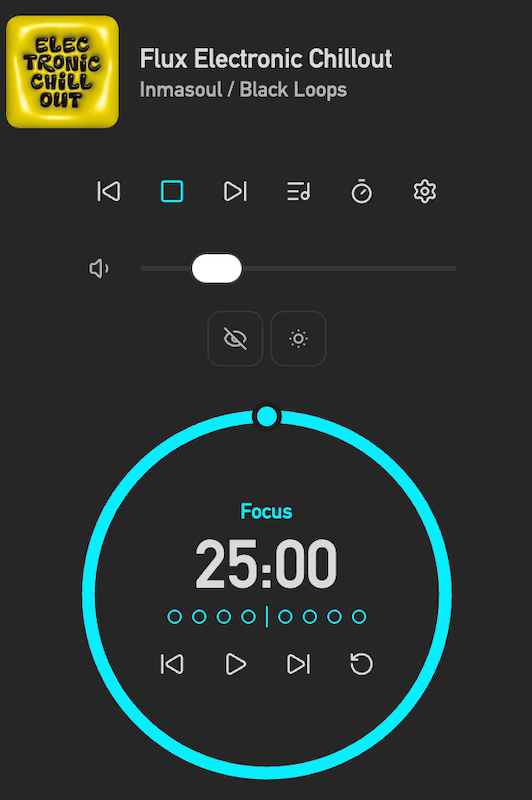
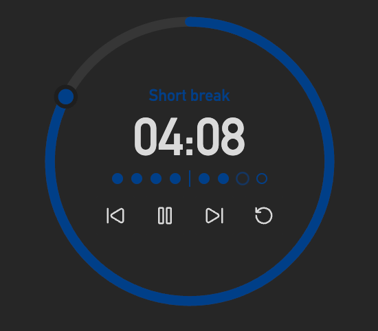
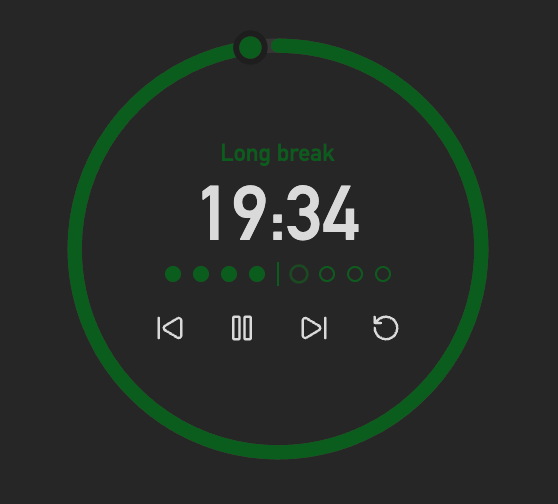
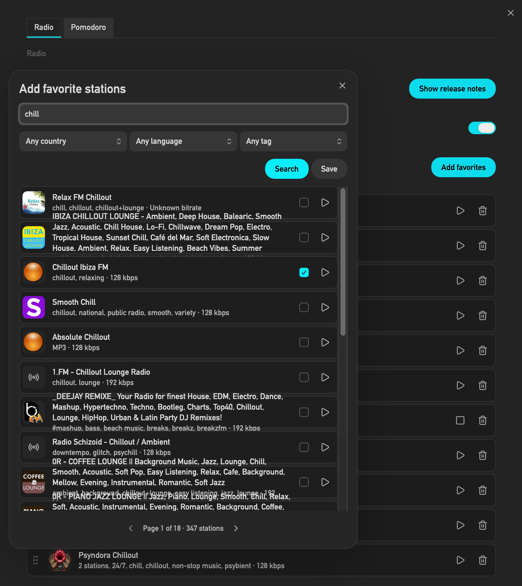
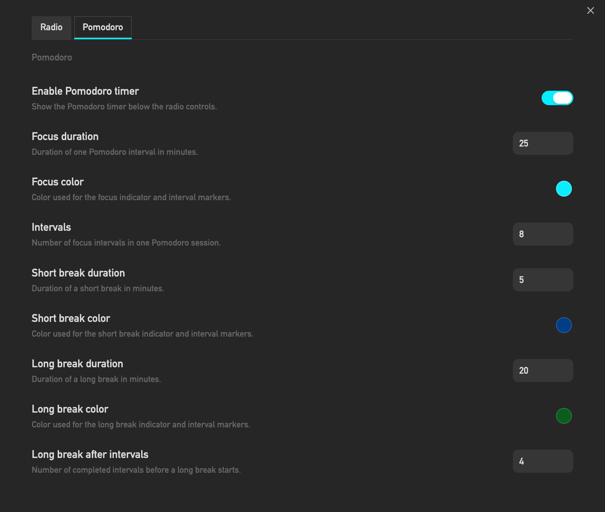
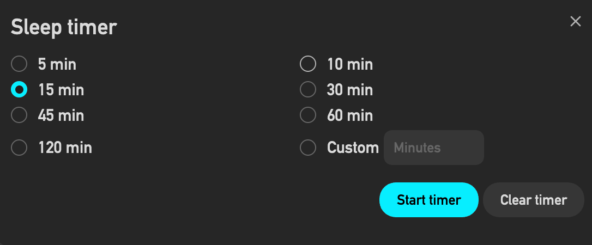

# StreamRadio

StreamRadio is an Obsidian plugin for listening to web radio stations from radio-browser.info, searching and saving favorites, and which lives in the right sidebar.
As an additional option, it also provides a highly customizable and appealing Pomodoro timer for working focused on your tasks, accompanied by the tunes you favor.

## Features

- Search stations by name, country, language, and tag through the radio-browser.info API.
- Add custom stations, if not available in the catalog.
- Preview stations directly in the search dialog before saving them in your favorites list.
- Re-order favorites with drag and drop in the settings tab.
- Show or hide station logos in the player.
- Show live track metadata below the station name when the current desktop stream provides ICY metadata.
- Start, pause, skip to the previous or next favorit station.
- Adjust playback volume with a slider in the player.
- Start a timer with 5, 10, 15, 30, 45, 60, 120 minutes, or a custom minute value.
- Run Pomodoro focus sessions with short and long breaks while listening to streams.
- Customize Pomodoro durations, interval count, long-break cadence, focus/break colors, and reduced-distraction dimming.
- Hear louder Pomodoro audio cues, including a 10-second countdown at the end of focus and break phases.
- Apply Pomodoro duration changes immediately to the current timer without resetting it manually.
- A reduced distraction mode for the Pomodoro display, allowing users to dim the display during focus intervals and toggle its visibility. 

## Player

StreamRadio adds a radio icon to the left ribbon. The icon opens the StreamRadio player in Obsidian's right sidebar. If the sidebar already contains other views, StreamRadio opens as another tab.

The player shows:

- Clickable Station logo, when enabled
- Station name
- Song, performer or other information provided by the radio station
- Playback controls, skip to next/previous station
- Volume slider
- Sleep timer status
- Optional: Pomodoro timer with interval markers, focus/break labels, countdown ring, louder 10-second audio countdowns, start, pause, restart, skip, reset, and hide/show controls

## Settings

The settings tab contains:

- A release notes button styled as a primary action.
- A toggle for station logos in the player.
- A button for opening the station search modal.
- The saved favorites list.
- A Pomodoro section for enabling the timer, setting focus and break durations, choosing focus, short-break, and long-break colors, configuring reduced-distraction dimming, selecting the number of intervals, and configuring when long breaks occur.

The search modal shows 20 results per page and displays the current page with the total page count. Additional results can be reached with previous and next arrow buttons. Every result row shows station logo, station name, codec, bitrate, a favorite checkbox, and a preview play button.

## radio-browser.info

StreamRadio uses the public radio-browser.info API:

- `https://all.api.radio-browser.info/json/countries`
- `https://all.api.radio-browser.info/json/languages`
- `https://all.api.radio-browser.info/json/tags`
- `https://all.api.radio-browser.info/json/stations/search`

The plugin uses Obsidian's `requestUrl` API for network requests. StreamRadio is a desktop-only Obsidian plugin and supports Windows, macOS, and Linux.

**Note:** The database server on radio-browser.info is sometimes (very rarely) not instantly availabel. This is not an issue of the plugin but of the database server itself. The search modal indicates the availability status of server and allows to refresh the status. 

## Obsidian guidelines

StreamRadio follows the Obsidian plugin guidelines:

- It uses the plugin instance `this.app` instead of the global app object.
- It avoids direct file system access.
- It stores plugin settings through Obsidian plugin data APIs.
- It uses Obsidian DOM helper methods instead of HTML string injection.
- It avoids `innerHTML`, `outerHTML`, and `insertAdjacentHTML`.
- It uses CSS classes and Obsidian CSS variables instead of hardcoded inline styling.
- It uses the Obsidian accent color variables for the default Pomodoro focus color.
- It uses popout-compatible document access where needed.
- It does not set default hotkeys.
- It cleans up audio playback and timers on unload.

## Disclosures

- This plugin uses the network to search and play public web radio streams.
- Station search data comes from radio-browser.info.
- Playback connects directly to the stream URL provided by each station.
- Live track metadata is retrieved on desktop by opening one direct HTTP/HTTPS request to the currently playing station stream URL with the `Icy-MetaData: 1` request header. This request goes to the selected station stream, follows station redirects, and is stopped when playback stops.
- This plugin does not require an account.
- This plugin does not require payment for full functionality.
- This plugin does not include telemetry.
- This plugin does not show ads.
- This plugin does not read or write notes in your vault.

## Limitations

- Desktop only. Mobile Obsidian is not supported.
- Supported operating systems are Windows, macOS, and Linux.
- Stream availability depends on the station data provided by radio-browser.info and the radio station itself.
- Live artist and song metadata depends on the current station providing ICY metadata.
- Drag and drop in the favorites list uses standard browser drag events because Obsidian does not provide a dedicated reorder-list component.

## License

MIT

## Donations

- 
- [PayPal.me](https://paypal.me/FoziN)
